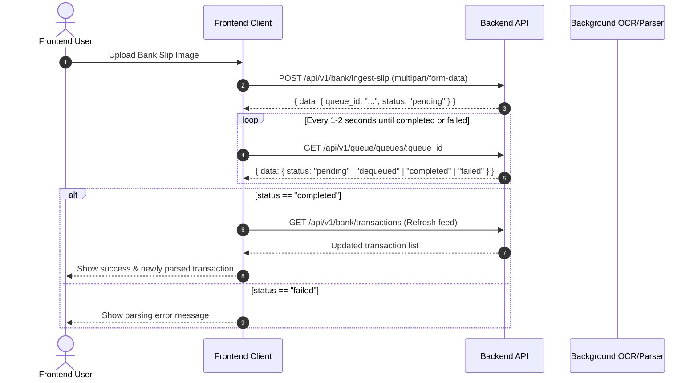

# Backend API Specification & Frontend Integration Guide

Base URL: `http://<host>:<port>/api/v1` (Default local: `http://localhost:8080/api/v1`)

---

## 1. Core Architecture & Protocol Conventions

### 1.1 Response Envelope

All API responses follow a strict envelope structure.

#### Success Response

```json
{
  "data": { ... }
}
```

#### Error Response

```json
{
	"data": {},
	"errors": {
		"message": "Human readable error cause",
		"code": "Request.Validation.Invalid",
		"stack": "Detailed error wrap chain (development/debug)",
		"violations": {
			"field_name": {
				"code": "Request.Validation.Invalid",
				"message": "Specific field error description",
				"stack": "optional debug stack"
			}
		}
	}
}
```

### 1.2 Global Error Codes & HTTP Status Mapping

| Service Error Code                    | HTTP Status                 | Description                                                           |
| :------------------------------------ | :-------------------------- | :-------------------------------------------------------------------- |
| `Request.Validation.Invalid`          | `400 Bad Request`           | Missing or invalid request parameters, validation tag failures        |
| `Service.Authentication.Unauthorized` | `401 Unauthorized`          | Missing/invalid bearer token, bad credentials                         |
| `Service.Authentication.InvalidToken` | `401 Unauthorized`          | Session token expired                                                 |
| `Service.Authorization.Forbidden`     | `403 Forbidden`             | Access denied for the current user role                               |
| `Service.Resource.NotFound`           | `404 Not Found`             | Entity does not exist (User, Category, Transaction, etc.)             |
| `Service.Resource.Conflict`           | `409 Conflict`              | Unique constraint conflict (e.g., username taken, duplicate category) |
| `Service.Internal.Error`              | `500 Internal Server Error` | Unexpected backend or database failure                                |

### 1.3 Authentication

All authenticated endpoints require an `Authorization` header with a Bearer token:

```http
Authorization: Bearer <session_token>
```

Session tokens are 64-character hex strings generated at `/api/v1/authentication/login`.

---

## 2. Common Domain Enums & TypeScript Models

```typescript
// Core types
export type ObjectID = string; // 24-character hex MongoDB ObjectID string
export type ISO8601String = string; // e.g. "2026-08-18T10:00:00Z"

// Base model fields embedded in all stored entities
export interface ModelBase {
	id: ObjectID;
	created_at: ISO8601String;
	updated_at: ISO8601String;
}

// User
export interface User extends ModelBase {
	username: string;
}

export interface UserSession {
	user_id: ObjectID;
	token: string;
	expires_at: ISO8601String;
}

// Bank Enums
export type BankTransactionDirection = "in" | "out" | "transfer";

export type QueueItemStatus =
	| "unknown"
	| "pending"
	| "dequeued"
	| "completed"
	| "failed"
	| "canceled"
	| "retry";

export type Priority = 0 | 1 | 2 | 3 | 4; // 0=Lowest, 2=Normal, 4=Highest

// Bank
export interface Bank extends ModelBase {
	code: string;
	name: string;
}

// Bank Account
export interface BankAccount extends ModelBase {
	user_id: ObjectID;
	bank_id: ObjectID;
	account_number: string;
	name: string;
	is_third_party: boolean;
	default_category_id?: ObjectID;
	color?: string;
	note?: string;
}

// Bank Category
export interface BankCategory extends ModelBase {
	user_id: ObjectID;
	name: string;
	color?: string;
	icon?: string;
}

// Bank Transaction
export interface BankTransaction extends ModelBase {
	user_id: ObjectID;
	from_bank_account_id?: ObjectID;
	to_bank_account_id?: ObjectID;
	transaction_number: string;
	direction: BankTransactionDirection;
	amount: number;
	fee: number;
	currency: string;
	reference?: string;
	occurred_at: ISO8601String;
	raw_text: string;
	note?: string;
	category_id?: ObjectID;
}

// Bank Mail Inbox
export interface BankMailInbox extends ModelBase {
	user_id: ObjectID;
	token: string;
}

// Pagination Collection
export interface CollectionMeta {
	total: number;
	total_pages: number;
}

export interface Collection<T> {
	collection: T[];
	count: number;
	meta: CollectionMeta;
}
```

---

## 3. API Endpoints

### 3.1 Authentication

#### 3.1.1 Register User

- **Method:** `POST`
- **Path:** `/api/v1/authentication/register`
- **Auth Required:** No
- **Headers:** `Content-Type: application/json`
- **Request Body:**

```json
{
	"username": "alice",
	"password": "strongpassword123"
}
```

> **Validation:**
>
> - `username`: string, required, regex `^[a-z0-9._]+$` (lowercase letters, digits, dots, underscores).
> - `password`: string, required, min length 1.

- **Response (200 OK):**

```json
{
	"data": {
		"user": {
			"id": "66487e411b0e35fa8f01b101",
			"username": "alice",
			"created_at": "2026-08-18T09:00:00Z",
			"updated_at": "2026-08-18T09:00:00Z"
		}
	}
}
```

- **Error Responses:**
    - `400 Bad Request` (`Request.Validation.Invalid`): Invalid username characters or empty field.
    - `409 Conflict` (`Service.Resource.Conflict`): Username already taken (`violations.username`).

---

#### 3.1.2 Login User

- **Method:** `POST`
- **Path:** `/api/v1/authentication/login`
- **Auth Required:** No
- **Headers:** `Content-Type: application/json`
- **Request Body:**

```json
{
	"username": "alice",
	"password": "strongpassword123"
}
```

- **Response (200 OK):**

```json
{
	"data": {
		"session": {
			"user_id": "66487e411b0e35fa8f01b101",
			"token": "a1b2c3d4e5f60718293a4b5c6d7e8f90a1b2c3d4e5f60718293a4b5c6d7e8f90",
			"expires_at": "2026-09-17T09:00:00Z"
		}
	}
}
```

> **Frontend Integration Note:** Store `session.token` in secure storage (cookie / localStorage) and attach as `Authorization: Bearer <token>` on all subsequent requests.

- **Error Responses:**
    - `401 Unauthorized` (`Service.Authentication.Unauthorized`): Invalid username or password.

---

### 3.2 Current User

#### 3.2.1 Get Current Profile (`@me`)

- **Method:** `GET`
- **Path:** `/api/v1/user/users/@me`
- **Auth Required:** Yes (`Bearer <token>`)
- **Response (200 OK):**

```json
{
	"data": {
		"user": {
			"id": "66487e411b0e35fa8f01b101",
			"username": "alice",
			"created_at": "2026-08-18T09:00:00Z",
			"updated_at": "2026-08-18T09:00:00Z"
		}
	}
}
```

- **Error Responses:**
    - `401 Unauthorized`: Token missing, invalid, or expired.
    - `404 Not Found`: User account no longer exists.

---

### 3.3 Bank Categories

#### 3.3.1 List Categories

- **Method:** `GET`
- **Path:** `/api/v1/bank/categories`
- **Auth Required:** Yes
- **Response (200 OK):**

```json
{
	"data": {
		"categories": [
			{
				"id": "664880501b0e35fa8f01b102",
				"user_id": "66487e411b0e35fa8f01b101",
				"name": "Food & Dining",
				"color": "#FF5733",
				"icon": "utensils",
				"created_at": "2026-08-18T09:10:00Z",
				"updated_at": "2026-08-18T09:10:00Z"
			}
		]
	}
}
```

#### 3.3.2 Create Category

- **Method:** `POST`
- **Path:** `/api/v1/bank/categories`
- **Auth Required:** Yes
- **Headers:** `Content-Type: application/json`
- **Request Body:**

```json
{
	"name": "Utilities",
	"color": "#3498DB",
	"icon": "bolt"
}
```

> **Validation:**
>
> - `name`: string, required, min length 1.
> - `color`: string, optional.
> - `icon`: string, optional.

- **Response (200 OK):**

```json
{
	"data": {
		"category": {
			"id": "664881001b0e35fa8f01b103",
			"user_id": "66487e411b0e35fa8f01b101",
			"name": "Utilities",
			"color": "#3498DB",
			"icon": "bolt",
			"created_at": "2026-08-18T09:15:00Z",
			"updated_at": "2026-08-18T09:15:00Z"
		}
	}
}
```

- **Error Responses:**
    - `409 Conflict` (`Service.Resource.Conflict`): Category name already exists for this user.

#### 3.3.3 Get Category by ID

- **Method:** `GET`
- **Path:** `/api/v1/bank/categories/:id`
- **Auth Required:** Yes
- **Path Params:**
    - `id`: 24-character hex MongoDB ObjectID
- **Response (200 OK):**

```json
{
	"data": {
		"category": {
			"id": "664881001b0e35fa8f01b103",
			"user_id": "66487e411b0e35fa8f01b101",
			"name": "Utilities",
			"color": "#3498DB",
			"icon": "bolt",
			"created_at": "2026-08-18T09:15:00Z",
			"updated_at": "2026-08-18T09:15:00Z"
		}
	}
}
```

#### 3.3.4 Update Category

- **Method:** `PATCH` or `PUT`
- **Path:** `/api/v1/bank/categories/:id`
- **Auth Required:** Yes
- **Headers:** `Content-Type: application/json`
- **Request Body:**

```json
{
	"name": "Home & Utilities",
	"color": "#2980B9",
	"icon": "home"
}
```

> All fields are optional. Only provided non-nil fields will be updated.

- **Response (200 OK):**

```json
{
	"data": {
		"category": {
			"id": "664881001b0e35fa8f01b103",
			"user_id": "66487e411b0e35fa8f01b101",
			"name": "Home & Utilities",
			"color": "#2980B9",
			"icon": "home",
			"created_at": "2026-08-18T09:15:00Z",
			"updated_at": "2026-08-18T09:20:00Z"
		}
	}
}
```

#### 3.3.5 Delete Category

- **Method:** `DELETE`
- **Path:** `/api/v1/bank/categories/:id`
- **Auth Required:** Yes
- **Response (200 OK):**

```json
{
	"data": {
		"deleted": true
	}
}
```

---

### 3.4 Bank Management

#### 3.4.1 List Banks

- **Method:** `GET`
- **Path:** `/api/v1/bank/banks`
- **Auth Required:** Yes
- **Response (200 OK):**

```json
{
	"data": {
		"banks": [
			{
				"id": "664880001b0e35fa8f01b100",
				"code": "KBANK",
				"name": "KASIKORNBANK",
				"created_at": "2026-08-18T09:00:00Z",
				"updated_at": "2026-08-18T09:00:00Z"
			}
		]
	}
}
```

#### 3.4.2 Create Bank

- **Method:** `POST`
- **Path:** `/api/v1/bank/banks`
- **Auth Required:** Yes
- **Request Body:**

```json
{
	"code": "BBL",
	"name": "Bangkok Bank"
}
```

#### 3.4.3 Get Bank by ID

- **Method:** `GET`
- **Path:** `/api/v1/bank/banks/:id`
- **Auth Required:** Yes

#### 3.4.4 Update Bank

- **Method:** `PATCH` or `PUT`
- **Path:** `/api/v1/bank/banks/:id`
- **Auth Required:** Yes
- **Request Body:**

```json
{
	"code": "BBL",
	"name": "Bangkok Bank Public Company Limited"
}
```

#### 3.4.5 Delete Bank

- **Method:** `DELETE`
- **Path:** `/api/v1/bank/banks/:id`
- **Auth Required:** Yes

---

### 3.5 Bank Accounts

#### 3.5.1 List User Bank Accounts

- **Method:** `GET`
- **Path:** `/api/v1/bank/accounts`
- **Auth Required:** Yes
- **Response (200 OK):**

```json
{
	"data": {
		"accounts": [
			{
				"id": "664880501b0e35fa8f01b108",
				"user_id": "66487e411b0e35fa8f01b101",
				"bank_id": "664880001b0e35fa8f01b100",
				"account_number": "xxx-x-x1456-x",
				"name": "Main Savings",
				"note": "Primary savings account",
				"created_at": "2026-08-18T08:00:00Z",
				"updated_at": "2026-08-18T08:00:00Z"
			}
		]
	}
}
```

#### 3.5.2 Create Bank Account

- **Method:** `POST`
- **Path:** `/api/v1/bank/accounts`
- **Auth Required:** Yes
- **Request Body:**

```json
{
	"bank_id": "664880001b0e35fa8f01b100",
	"account_number": "xxx-x-x1456-x",
	"name": "Main Savings",
	"is_third_party": false,
	"default_category_id": "664880501b0e35fa8f01b102",
	"note": "Primary savings account"
}
```

#### 3.5.3 Get Bank Account by ID

- **Method:** `GET`
- **Path:** `/api/v1/bank/accounts/:id`
- **Auth Required:** Yes

#### 3.5.4 Update Bank Account

- **Method:** `PATCH` or `PUT`
- **Path:** `/api/v1/bank/accounts/:id`
- **Auth Required:** Yes
- **Request Body:**

```json
{
	"name": "Personal Savings",
	"is_third_party": false,
	"default_category_id": "664880501b0e35fa8f01b102",
	"note": "Updated notes"
}
```

#### 3.5.5 Delete Bank Account

- **Method:** `DELETE`
- **Path:** `/api/v1/bank/accounts/:id`
- **Auth Required:** Yes

---

### 3.6 Bank Transactions

#### 3.6.1 List Transactions

- **Method:** `GET`
- **Path:** `/api/v1/bank/transactions`
- **Auth Required:** Yes
- **Query Parameters:**
    - `page`: integer (default `1`)
    - `amount`: integer (default `10`, items per page)
    - `from`: optional lower bound on `occurred_at`, inclusive. RFC3339 or `YYYY-MM-DD`.
    - `to`: optional upper bound on `occurred_at`, exclusive. RFC3339 or `YYYY-MM-DD`.
- **Response (200 OK):**

```json
{
	"data": {
		"transactions": {
			"collection": [
				{
					"id": "664882001b0e35fa8f01b104",
					"user_id": "66487e411b0e35fa8f01b101",
					"from_bank_account_id": "664880501b0e35fa8f01b108",
					"to_bank_account_id": "664880501b0e35fa8f01b109",
					"transaction_number": "TX-20260818-001",
					"direction": "out",
					"amount": 350.0,
					"fee": 0.0,
					"currency": "THB",
					"reference": "PromptPay Transfer",
					"occurred_at": "2026-08-18T08:30:00Z",
					"raw_text": "...",
					"note": "Team lunch",
					"category_id": "664880501b0e35fa8f01b102",
					"created_at": "2026-08-18T08:30:05Z",
					"updated_at": "2026-08-18T08:30:05Z"
				}
			],
			"count": 1,
			"meta": {
				"total": 45,
				"total_pages": 5
			}
		}
	}
}
```

#### 3.6.2 Create Manual Transaction

- **Method:** `POST`
- **Path:** `/api/v1/bank/transactions`
- **Auth Required:** Yes
- **Headers:** `Content-Type: application/json`
- **Request Body:**

```json
{
	"direction": "out",
	"amount": 150.0,
	"fee": 0,
	"currency": "THB",
	"occurred_at": "2026-08-18T10:00:00Z",
	"transaction_number": "TX-MANUAL-001",
	"from_bank_account_id": "664880501b0e35fa8f01b108",
	"to_bank_account_id": "664880501b0e35fa8f01b109",
	"category_id": "664880501b0e35fa8f01b102",
	"note": "Coffee and dessert"
}
```

> **Validation & Defaults:**
>
> - `direction`: `"in"` | `"out"` | `"transfer"`, required.
> - `amount`: number `> 0`, required.
> - `fee`: number `>= 0` (optional, default `0`).
> - `currency`: string (optional, default `"THB"`).
> - `from_bank_account_id`: ObjectID hex string (optional).
> - `to_bank_account_id`: ObjectID hex string (optional).
> - `category_id`: ObjectID hex string (optional).
> - `transaction_number`: string (optional, defaults to generated `TX-<object_id>`).

- **Response (200 OK):**

```json
{
	"data": {
		"transaction": {
			"id": "664883001b0e35fa8f01b106",
			"user_id": "66487e411b0e35fa8f01b101",
			"from_bank_account_id": "664880501b0e35fa8f01b108",
			"to_bank_account_id": "664880501b0e35fa8f01b109",
			"transaction_number": "TX-MANUAL-001",
			"direction": "out",
			"amount": 150.0,
			"fee": 0.0,
			"currency": "THB",
			"occurred_at": "2026-08-18T10:00:00Z",
			"raw_text": "MANUAL",
			"note": "Coffee and dessert",
			"category_id": "664880501b0e35fa8f01b102",
			"created_at": "2026-08-18T10:01:00Z",
			"updated_at": "2026-08-18T10:01:00Z"
		}
	}
}
```

#### 3.4.3 Get Transaction by ID

- **Method:** `GET`
- **Path:** `/api/v1/bank/transactions/:id`
- **Auth Required:** Yes
- **Response (200 OK):**

```json
{
	"data": {
		"transaction": {
			"id": "664883001b0e35fa8f01b106",
			"user_id": "66487e411b0e35fa8f01b101",
			"bank_id": "664880001b0e35fa8f01b100",
			"transaction_number": "TX-MANUAL-001",
			"direction": "out",
			"amount": 150.0,
			"fee": 0.0,
			"currency": "THB",
			"occurred_at": "2026-08-18T10:00:00Z",
			"raw_text": "MANUAL",
			"note": "Coffee and dessert",
			"category_id": "664880501b0e35fa8f01b102",
			"created_at": "2026-08-18T10:01:00Z",
			"updated_at": "2026-08-18T10:01:00Z"
		}
	}
}
```

#### 3.4.4 Update Transaction

- **Method:** `PATCH` or `PUT`
- **Path:** `/api/v1/bank/transactions/:id`
- **Auth Required:** Yes
- **Headers:** `Content-Type: application/json`
- **Request Body:**

```json
{
	"amount": 160.0,
	"fee": 0,
	"occurred_at": "2026-08-18T10:05:00Z",
	"from_account": "xxx-x-x5678-x",
	"note": "Updated note",
	"category_id": "664880501b0e35fa8f01b102",
	"direction": "out"
}
```

> Set `"category_id": ""` to clear the assigned category.

- **Response (200 OK):**

```json
{
	"data": {
		"transaction": {
			"id": "664883001b0e35fa8f01b106",
			"user_id": "66487e411b0e35fa8f01b101",
			"amount": 160.0,
			"fee": 0.0,
			"currency": "THB",
			"note": "Updated note",
			"category_id": "664880501b0e35fa8f01b102",
			"created_at": "2026-08-18T10:01:00Z",
			"updated_at": "2026-08-18T10:10:00Z"
		}
	}
}
```

#### 3.4.5 Delete Transaction

- **Method:** `DELETE`
- **Path:** `/api/v1/bank/transactions/:id`
- **Auth Required:** Yes
- **Response (200 OK):**

```json
{
	"data": {
		"deleted": true
	}
}
```

---

#### 3.4.6 Summarize Transactions

- **Method:** `GET`
- **Path:** `/api/v1/bank/transactions/summary`
- **Auth Required:** Yes
- **Query Parameters:** same optional `from` / `to` half-open range as List Transactions. Omit both for an all-time summary.
- **Notes:** `net` is `total_in - total_out - total_fee`. `by_category` includes an
  entry with no `category_id` (named `Uncategorized`) when uncategorized
  transactions fall in the range. Transfers between the user's own accounts are
  excluded from `total_in`/`total_out`/`by_category` — they aren't spend.
- **Response (200 OK):**

```json
{
	"data": {
		"summary": {
			"from": "2026-08-01T00:00:00Z",
			"to": "2026-09-01T00:00:00Z",
			"total_in": 52000.0,
			"total_out": 18430.5,
			"total_fee": 25.0,
			"net": 33544.5,
			"count": 42,
			"by_category": [
				{
					"category_id": "664880501b0e35fa8f01b102",
					"name": "Food",
					"color": "#FF8A00",
					"in": 0.0,
					"out": 4820.0,
					"count": 17
				},
				{
					"name": "Uncategorized",
					"in": 2000.0,
					"out": 610.5,
					"count": 4
				}
			]
		}
	}
}
```

#### 3.4.7 Summarize Transactions Time Series

- **Method:** `GET`
- **Path:** `/api/v1/bank/transactions/timeseries`
- **Auth Required:** Yes
- **Query Parameters:**
    - `granularity` (optional, one of `day`/`week`/`month`, default `month`)
    - `from` / `to` (optional, same half-open range as List Transactions)
- **Notes:** One bucket per `granularity` unit spanning the range, sorted ascending by `bucket`. `net` is `in - out - fee`. Transfers are excluded from `in`/`out`, same as Summarize Transactions.
- **Response (200 OK):**

```json
{
	"data": {
		"points": [
			{
				"bucket": "2026-07-01T00:00:00Z",
				"in": 52000.0,
				"out": 18430.5,
				"fee": 25.0,
				"net": 33544.5,
				"count": 42
			}
		]
	}
}
```

#### 3.4.8 Summarize Transactions Breakdown

- **Method:** `GET`
- **Path:** `/api/v1/bank/transactions/breakdown`
- **Auth Required:** Yes
- **Query Parameters:**
    - `dimension` (required, one of `account`/`weekday`/`reference`)
    - `from` / `to` (optional, same half-open range as List Transactions)
- **Notes:** Spend-only (`direction: out`) ranked breakdown, top 20 buckets by amount descending. `account` resolves `key`/`label`/`color` from the user's bank accounts (`key: "unknown"` for transactions with no `from_bank_account_id`). `weekday` keys are ISO weekday numbers (`"1"`=Monday..`"7"`=Sunday) with English day-name labels. `reference` groups case-insensitively, keeping the first-seen casing as `label`, and skips transactions with an empty reference.
- **Response (200 OK):**

```json
{
	"data": {
		"breakdown": {
			"dimension": "account",
			"from": "2026-08-01T00:00:00Z",
			"to": "2026-09-01T00:00:00Z",
			"buckets": [
				{
					"key": "664880501b0e35fa8f01b105",
					"label": "Main Account",
					"color": "#3B82F6",
					"amount": 18430.5,
					"count": 25
				}
			]
		}
	}
}
```

### 3.5 Automated Slip Ingestion & Queue Polling Flow

#### 3.5.1 Upload Slip Image (Enqueues Ingestion)

- **Method:** `POST`
- **Path:** `/api/v1/bank/ingest-slip`
- **Auth Required:** Yes
- **Content-Type:** `multipart/form-data` with form field `image` or `file`, or raw image binary body
- **Request (FormData):**

```typescript
const formData = new FormData();
formData.append("image", fileBlob, "slip.jpg");
```

- **Response (200 OK):**

```json
{
	"data": {
		"queue_id": "664884501b0e35fa8f01b108",
		"status": "pending"
	}
}
```

#### 3.5.2 Poll Queue Status

- **Method:** `GET`
- **Path:** `/api/v1/queue/queues/:id`
- **Auth Required:** Yes
- **Path Param:** `id` -> the `queue_id` returned from slip upload
- **Response (200 OK):**

```json
{
	"data": {
		"id": "664884501b0e35fa8f01b108",
		"action_type": "Bank.Slip.Ingest",
		"data": {
			"user_id": "66487e411b0e35fa8f01b101"
		},
		"status": "completed",
		"message": "",
		"priority": 2,
		"scheduled_at": null
	}
}
```

#### Frontend Flow Diagram for Slip Ingestion



---

### 3.6 Bank Mail Forwarding Ingestion

#### 3.6.1 Get User's Unique Forwarding Email Address

- **Method:** `GET`
- **Path:** `/api/v1/bank/mail-inbox`
- **Auth Required:** Yes
- **Response (200 OK):**

```json
{
	"data": {
		"address": "bank-89ef488f28d84144b62f2c8d2047326e@mail.example.com",
		"inbox": {
			"id": "664885001b0e35fa8f01b109",
			"user_id": "66487e411b0e35fa8f01b101",
			"token": "89ef488f28d84144b62f2c8d2047326e",
			"created_at": "2026-08-18T09:00:00Z",
			"updated_at": "2026-08-18T09:00:00Z"
		}
	}
}
```

> **Frontend Integration Note:** Display `data.address` in settings or onboarding. Users configure email forwarding in their email client (Gmail / Outlook) to forward bank alert emails to this address.

#### 3.6.2 Inbound Webhook (System Endpoint)

- **Method:** `POST`
- **Path:** `/api/v1/bank/inbound`
- **Auth:** Mailgun HMAC Webhook Signature (`timestamp`, `token`, `signature` form fields).
- **Consumes:** `multipart/form-data` with fields `recipient`, `body-plain`, `stripped-text`.
- **Note:** This is called by Mailgun servers, not the frontend.

---

## 4. Frontend Client Integration Helper (TypeScript / Axios Example)

```typescript
import axios, { AxiosInstance, AxiosResponse } from "axios";

export interface ApiResponse<T> {
	data: T;
	errors?: {
		message: string;
		code: string;
		stack?: string;
		violations?: Record<string, { code: string; message: string }>;
	};
}

export class ApiClient {
	private client: AxiosInstance;

	constructor(baseURL: string = "/api/v1") {
		this.client = axios.create({
			baseURL,
			headers: {
				"Content-Type": "application/json",
			},
		});

		this.client.interceptors.request.use((config) => {
			const token = localStorage.getItem("auth_token");
			if (token) {
				config.headers.Authorization = `Bearer ${token}`;
			}
			return config;
		});

		this.client.interceptors.response.use(
			(response) => response,
			(error) => {
				if (error.response?.status === 401) {
					// Token expired or unauthenticated
					localStorage.removeItem("auth_token");
					// Dispatch auth redirect
				}
				return Promise.reject(error.response?.data?.errors || error);
			},
		);
	}

	// Auth
	async login(username: string, password: string) {
		const res = await this.client.post<
			ApiResponse<{
				session: { token: string; user_id: string; expires_at: string };
			}>
		>("/authentication/login", { username, password });
		localStorage.setItem("auth_token", res.data.data.session.token);
		return res.data.data.session;
	}

	async register(username: string, password: string) {
		const res = await this.client.post<ApiResponse<{ user: User }>>(
			"/authentication/register",
			{ username, password },
		);
		return res.data.data.user;
	}

	async getMe() {
		const res =
			await this.client.get<ApiResponse<{ user: User }>>(
				"/user/users/@me",
			);
		return res.data.data.user;
	}

	// Transactions
	async listTransactions(page = 1, amount = 10) {
		const res = await this.client.get<
			ApiResponse<{ transactions: Collection<BankTransaction> }>
		>("/bank/transactions", { params: { page, amount } });
		return res.data.data.transactions;
	}

	async createTransaction(payload: Partial<BankTransaction>) {
		const res = await this.client.post<
			ApiResponse<{ transaction: BankTransaction }>
		>("/bank/transactions", payload);
		return res.data.data.transaction;
	}

	// Slips
	async uploadSlip(file: File) {
		const formData = new FormData();
		formData.append("image", file);
		const res = await this.client.post<
			ApiResponse<{ queue_id: string; status: QueueItemStatus }>
		>("/bank/ingest-slip", formData, {
			headers: { "Content-Type": "multipart/form-data" },
		});
		return res.data.data;
	}

	async checkQueue(queueId: string) {
		const res = await this.client.get<
			ApiResponse<{
				id: string;
				status: QueueItemStatus;
				message?: string;
			}>
		>(`/queue/queues/${queueId}`);
		return res.data.data;
	}
}
```
